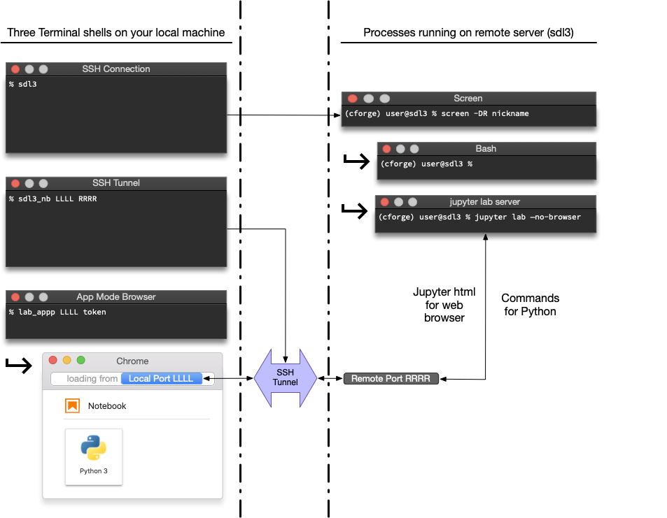
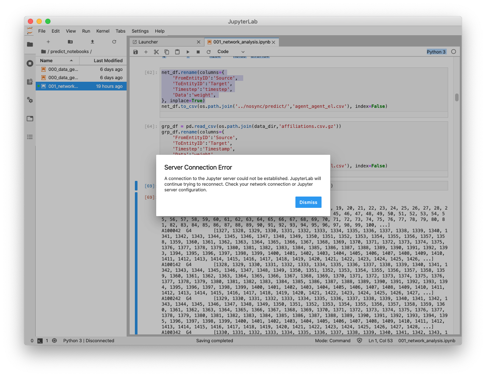
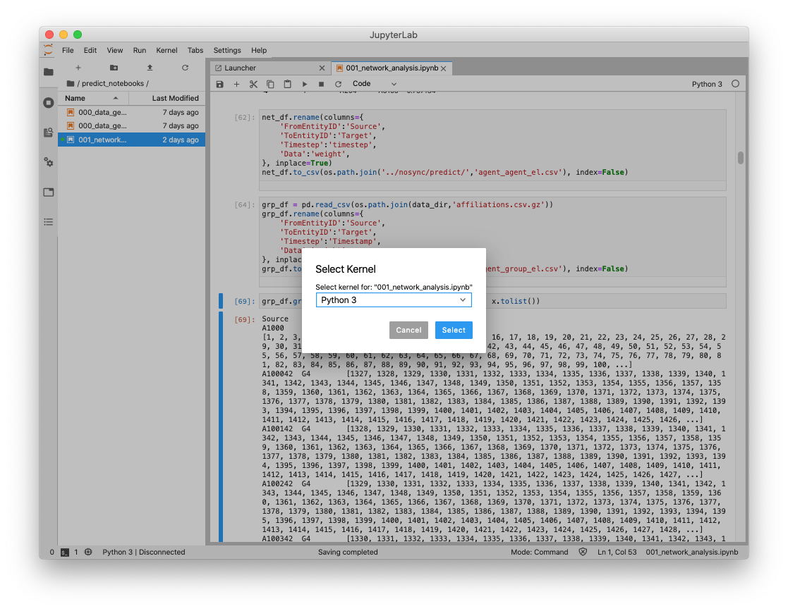

# Remote jupyter lab via ssh

Folks that need access to SDL3 should get in touch with Chris Cameron / @chris on Slack /  cjc73@cornell.edu. I will need a preferred `username` and your RSA 4096b public key (~/.ssh/id_rsa.pub) after you [generate an ssh key](https://help.github.com/en/github/authenticating-to-github/generating-a-new-ssh-key-and-adding-it-to-the-ssh-agent). *Note: there is a risk of overwriting an existing key, so verify that id\_rsa does not already exist.*


The process outlined below is how most of the SDL server users choose to work. We SSH into the server, start a jupyter lab server on the machine and then create an ssh tunnel to connect the jupyter remote port to a local port. Finally, we direct our web browser to connect to that local port with the proper token so the jupyter lab interface loads in our local browser. It looks like a lot of work because I provided a lot of detail. In practice, I have the 3 Terminal/iTerm tabs open all the time and I use the up arrow to scroll the recent command history to find the commands I need. About 98% of the work is the initial screen setup and jupyter config. The rest is, shall we say... _history_. (up arrow through command history).

The diagram below identifies the major elements of the setup. You use the first ssh connection to start the jupyter server on the remote machine and connect to that server via the SSH Tunnel. 




## Setup

I define an alias and two functions in my local `~/.zshrc` to help smooth this process. If you are using bash, the syntax is nearly the same. (you may need to add additional lines to `export -f` the new functions (ask Amruta).

1. The `alias` creates a shortcut to ssh into sdl3.soc.cornell.edu. You can define extra options here (like `-i ~/path/to/identityfile` if you are not using a key named `id_rsa`)

2. The first function `sdl3` uses ssh to link a local port to a remote port on sdl3. The usage syntax is `sdl3_nb LLLL RRRR` where `LLLL` is the **_local port number_** and `RRRR` is the **_remote port number_**.

3. The second function is optional, but conveniently opens google chrome in app mode using a specified local port and the token generated by your jupyter lab server instance. (**lab**+**app**+**p**ort). Usage is `lab_appp XXXX tokenassignedbyjupyter`


I put these in my `~/.zshrc` using `nano ~/.zshrc` or equivalent, then `source ~/.zshrc` to load the changes (or open a new terminal window). 

```
alias sdl3='ssh userid@sdl3.soc.cornell.edu'  

sdl3_nb() { ssh -N -L "$1":localhost:"$2" userid@sdl3.soc.cornell.edu; }

lab_appp() { /Applications/Google\ Chrome.app/Contents/MacOS/Google\ Chrome --app="http://localhost:""$1""/?token=""$2"";"; }
```

## Connect ##
(**Note**:`$` represents the prompt, don't type it)  

### Terminal window or tab #1:

Make a new terminal window that will manage the interactive connection to sdl3. 


#### Connect to sdl3 as follows:

```shell
$ sdl3

```

Some text scrolls by and the prompt will show something like the following if successful:    

```shell
Last login: Mon Mar 23 18:55:30 2020 from 74.79.254.246
(cforge) cjc73@sdl3:~$ 
```

#### Start or resume screen 
Use `screen` to keep your session alive. You choose the string to substitute for nickname. Make it easy to remember, yet descriptive. Note that you only type the things after the `$`:

```shell
(cforge) cjc73@sdl3:~$ screen -DR nickname
```
The prompt will move to the top of the terminal. A blue bar will appear at the bottom of the terminal. This is screen and it will keep your jupyter lab server open. Return to it later using the same steps as above. See the page about screen for more details. 

#### Initial screen setup and jupyter lab launch (skip if already setup)

You can send commands to screen if you activate its command mode by typing `ctrl`+`a`. For a fraction of second after receiving this sequence, screen will watch for additional commands. In the text below, keys you press together will be joined by `+` and a comma represents the next step in the key sequence. For instance, `ctrl`+`a`, `c` means press `ctrl` and `a` simultaneously, release and then immediately press `c`. 

Here is my setup:  

1. Make a few screen tabs using sequence: `ctrl`+`a`, `c` a few times.   
2. Jump to the first "tab": `ctrl`+`a`, `0`  
3. Rename first tab: `ctrl`+`a`, `shift`+`a` then backspace to delete "bash" and type "jupyter". Press return to complete. 

While the jupyter tab is selected (name is in red), cd to the project directory on sdl3. Replace <project_directory> with the appropriate path for your project.  
 
```shell
(cforge) cjc73@sdl3:~$ cd /mnt/datamd/<project_directory>
```

the prompt will change to show the change in directory was successful:  

```shell
(cforge) cjc73@sdl3:/mnt/datamd/darpagt$
```

Now launch jupyter lab  

```shell
(cforge) cjc73@sdl3:/mnt/datamd/darpagt$ jupyter lab --no-browser
```

A lot of text will scroll by and the last lines will contain something like this:

```shell
The Jupyter Notebook is running at:
http://localhost:8890/?token=8cadcb48aac8bfcaf2bf5bd07bb67538a863367cbbae6645
 or http://127.0.0.1:8890/?token=8cadcb48aac8bfcaf2bf5bd07bb67538a863367cbbae6645
▊
```

Note the `localhost:<RRRR>` and `token=8cad....6645`. You will need these values for steps 2 and 3. 

**NOTE**: As the server runs, messages will accumulate, pushing this info off the screen. You can see this info at any time by pressing `ctrl`+`c` EXACTLY ONE TIME and then responding 'n' to the prompt. The prompt will offer to terminate the server, so pressing 'y' will close your work. Similarly, pressing `ctrl`+`c` twice in a 5 second interval will immediately terminate your jupyter server. Use it with some care. This might seem like bad design, but Linux is always one keypress from disaster. It makes us feel alive. 


### Terminal window or tab #2:

Link the remote port number from `localhost:RRRR` above and with some available local port number `LLLL`. Most of the time, RRRR and LLLL can be the same number. The exception is when you have multiple local jupyter servers already running on your computer. The command will complain if you try to use a port that is already assigned. If `LLLL` is in use, try `LLLL`+1. You don't get a choice of `RRRR` -- it is assigned by the server. 

Open a second Terminal window or tab. At the prompt, use the `sdl_nb` function to link the ports:

```shell
$ sdl3_nb LLLL RRRR
```
If nothing appears to happen, it worked! There should be no prompt at the bottom of the terminal, just a blank line. This means the link is open and it will stay open until this tab is closed. This step is done, so just leave that tab alone. If you close the tab, the port link will terminate and you will need to do this step again. 

```shell
$ sdl3_nb LLLL RRRR
▊
```

### Terminal window or tab #3:

I like to use jupyter lab in Chrome's app mode. This is optional, but I find it more ergonomic. Now that the server is running and the ports are linked, you just need to open a browser with the correct port and token. If Chrome is installed, you can open the jupyter lab interface as a Chrome app with the `lab_appp` function, filling in the token and ports from step one above. 

```shell
$ lab_appp LLLL 8cadcb48aac8bfcaf2bf5bd07bb67538a863367cbbae6645
```

Success looks like Chrome opening and loading the jupyter interface while the terminal looks like:

```shell
$ lab_appp LLLL 8cadcb48aac8bfcaf2bf5bd07bb67538a863367cbbae6645
▊
```
As with step 2 above, that empty line means the terminal is actively doing the assigned task (keeping chrome open). If you close the tab, Chrome will probably terminate and you will need to do this step again. 

##### If you prefer NOT to use Chrome's app mode, do this INSTEAD of step 3 
Take that URL from step one:  
`http://localhost:RRRR/?token=8cadcb48aac8bfcaf2bf5bd07bb67538a863367cbbae6645` and substitute the local port number `LLLL` in place of `RRRR`. If you were able to set up the link with `RRRR` equal to `LLLL`, then you don't need to change it. You can paste the url with the correct local port number into your web browser address bar to load jupyter lab. 


## Reconnect ##

If the port forwarding (Tab 2) stops (as will happen when your computer sleeps or you change to a different network), you will get a `Broken pipe` message the terminal and see a "Server Connection Error" in the JupyterLab interface. In almost every case, the server is still running and your work is saved. Broken ssh links is the most common situation you will encounter. You usually do not need to repeat the "Tab 1" directions unless the server reboots and you only need to repeat the "Tab 3" step if you close your web browser. 

You will see the following two signs that your port forwarding is broken: 

In Terminal:

```shell
$ sdl3 LLLL RRRR
packet_write_wait: Connection to 192.168.1.55 port 22: Broken pipe
$
```

In the JupyterLab interface: 



To resolve this, you need to restart the ssh link and then reconnect the notebook to the remoter kernel.  

1. Following the **Terminal window or tab #2** directions above to restore the port forwarding (essentially, press the up arrow in Terminal to recall command history and rerun the `sdl3_nb` command).

2. Click **Dismiss** on the *Server Connection Error* dialog. 

3. Notice how the lower left of the Jupyter window shows "Python 3 | Disconnected". This is an indication that you need to reconnect to the remote kernel. Click on the word Python 3 in the lower left to open the "Select Kernel" menu. In almost every case, you should choose the option under the heading "Use Kernel from Preferred Session", which will be named after your current notebook. This kernel has all the variables and data that you previously loaded.

4. If "Python 3 | Disconnected" does not change to "Python 3 | Idle" after you select a kernel, reload the browser window ("command+R" or "View > Reload this page", etc).  


